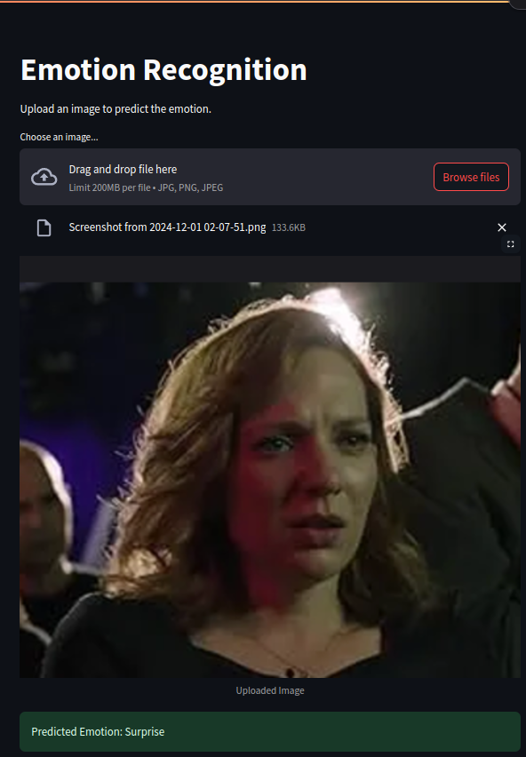
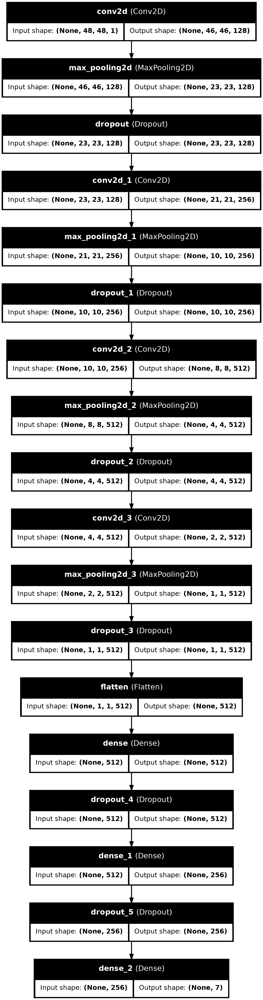

# Emotion Recognition with Deep Learning
An emotion recognition system using deep convolutional neural networks, built with TensorFlow/Keras and deployed via Streamlit.

#### Reference Paper


### Overview
This project implements a facial emotion recognition system that can classify 7 different emotions:

- Anger
- Disgust
- Fear
- Happy
- Sad
- Surprise
- Neutral

The system uses a CNN architecture with multiple convolutional and fully connected layers for feature extraction and classification.

### App GUI



### Installation
```bash
# Clone the repository
git clone https://github.com/yourusername/emotion-recognition.git
cd emotion-recognition

# Create virtual environment
python -m venv venv
source venv/bin/activate

# Install dependencies
pip install -r requirements.txt

# Download model weights
mkdir weights
# Download emotion_model.h5 and place in weights/ directory
```

### CNN Architecture



- Input layer: 48x48x1 grayscale images 
- 4 Convolutional blocks with:
    - Conv2D layers (128, 256, 512, 512 filters)
    - MaxPooling2D
    - Dropout (0.4)
    - 2 Dense layers (512, 256 units)
- Output layer: 7 units (softmax)

### Usage

#### Setup

1. Prepare your dataset in the following structure:

```
facial-expression-dataset/
├── train/
│   ├── anger/
│   ├── disgust/
│   └── ...
└── test/
    ├── anger/
    ├── disgust/
    └── ...
```
#### Running the Streamlit App

```bash 
streamlit run app.py
```

#### Training and Testing
```bash
# Train the model
python train.py

# Test the model
python test.py
```

#### Project Structure

```bash
├── facial-expression-dataset # Dataset used for training
├── app.py              # Streamlit web application
├── scripts/
    ├── dataloader.py       # Data loading and preprocessing
    ├── model.py           # Model architecture definition
    ├── train.py           # Training script
    ├── test.py            # Testing script

├── weights/           # Model weights
    ├── emotion_model.h5 # Compatible for tensorflow
├── media/
    ├── accuracy.png # Accuracy plot over 100 epochs
    ├── app-gui.png # Example of working streamlit app
    ├── loss.png # Accuracy plot over 100 epochs
    ├── model_architecture.png # DEfined model architecture

├── README.md
├── playgground.ipynb # Testing notebook
└── requirements.txt   # Project dependencies
```
